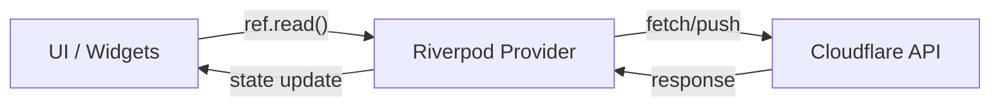

# 🗺️ Codebase Map - Dash for Cloudflare

> Mapa do código para navegação rápida e compreensão arquitetural. Consulte este arquivo para entender a organização do projeto e os padrões utilizados.

---

## 📂 Estrutura de Diretórios

```text
lib/
├── 🚀 main.dart                # Entry point, inicialização e ProviderScope
├── 🧠 core/                     # Código compartilhado e infraestrutura
│   ├── 🌐 api/                  # Cliente HTTP, Interceptors e Modelos Base
│   ├── 🏗️ constants/            # Constantes globais do app
│   ├── 🖥️ desktop/              # Suporte nativo (Window, Tray, Shortcuts)
│   ├── 🪵 logging/              # Sistema de logs in-app (Híbrido)
│   ├── 📱 platform/             # Detecção e abstração de plataforma
│   ├── 📦 providers/            # Providers globais (Dio, DataCenters)
│   ├── 🌐 pwa/                  # Suporte PWA (Update notifications)
│   ├── 🛣️ router/               # Configuração GoRouter e Navegação
│   ├── 🎨 theme/                # Design System (Material 3)
│   └── 🧩 widgets/              # Componentes UI reutilizáveis
├── 🏗️ features/                # Módulos de negócio (Domain-driven)
│   ├── 📊 analytics/            # DNS Analytics (GraphQL)
│   ├── 🔐 auth/                 # Autenticação, Configurações e Accounts
│   ├── 🌐 dns/                  # Gerenciamento de Zonas e Registros
│   └── 📄 pages/                # Cloudflare Pages (Projects, Deployments)
└── 🌍 l10n/                     # Internacionalização (en, pt)
```

---

## 🚀 Entry Point

| Arquivo | Responsabilidade |
|---------|------------------|
| `lib/main.dart` | Inicialização do Flutter, `LogService`, `DesktopWindowManager`, handlers de erro globais e o `ProviderScope` do Riverpod. |

---

## 🧠 Core (Infraestrutura)

### 🌐 API (`lib/core/api/`)

Utiliza **Retrofit** para REST e **GraphQL** para dados complexos.

| Arquivo | Responsabilidade |
|---------|------------------|
| `api_config.dart` | Gerenciamento de URLs (com/sem CORS proxy) e validação de tokens. |
| `client/cloudflare_api.dart` | Interface Retrofit para a API REST v4 da Cloudflare. |
| `client/cloudflare_graphql.dart` | Cliente manual para queries GraphQL de analytics. |
| `interceptors/` | Pipeline de requests: `Auth`, `Retry`, `RateLimit` e `Logging`. |
| `models/` | Wrappers genéricos de resposta e tratamento de erros da Cloudflare. |

### 🪵 Logging (`lib/core/logging/`)

Sistema híbrido (Console + In-App UI + Arquivo Opcional) conforme **ADR-021**.

| Arquivo | Responsabilidade |
|---------|------------------|
| `log_service.dart` | Singleton que centraliza todos os logs do sistema. |
| `log_provider.dart` | StateNotifier que expõe logs para a UI em tempo real. |
| `presentation/` | UI de visualização de logs para debug em produção. |

### 📦 Providers Globais (`lib/core/providers/`)

| Arquivo | Provider | Responsabilidade |
|---------|----------|------------------|
| `api_providers.dart` | `dioProvider` | Instância configurada do Dio com interceptors. |
| `data_centers_provider.dart` | `dataCentersProvider` | Mapeamento IATA codes → Coordenadas (ADR-008). |
| `loading_provider.dart` | `loadingProvider` | Estado global de carregamento (busy state). |

---

## 🏗️ Features (Módulos de Negócio)

### 🔐 Auth & Configs (`lib/features/auth/`)

Gerencia o estado global do app e credenciais sensíveis.

*   **Models:** `AppSettings` (Freezed) com token, tema e idioma.
*   **Storage:** Token armazenado via `FlutterSecureStorage` e preferências via `SharedPreferences`.
*   **Providers:** `settingsNotifierProvider` centraliza a persistência e estado.

### 🌐 DNS Management (`lib/features/dns/`)

O coração funcional do app. Implementa padrões de cache agressivos (**ADR-022**).

*   **Zones:** Lista de domínios com busca e seleção automática (**ADR-017**).
*   **Records:** CRUD completo de registros DNS com **Optimistic Updates** para o Proxy Toggle.
*   **Settings:** DNSSEC com polling inteligente e CNAME Flattening.
*   **Preloading:** `tabPreloaderProvider` carrega dados em background ao trocar de zona (**ADR-024**).

### 📊 Analytics (`lib/features/analytics/`)

Visualização de dados via GraphQL e Syncfusion.

*   **Dashboards:** Visão geral consolidada com abas **Web** (Tráfego), **Security** (Ameaças) e **Performance** (Cache).
*   **DNS Analytics:** Analytics específico para queries DNS (dentro da aba DNS).
*   **Charts:** Gráficos temporais (Line), distribuição (Donut) e geográficos (Maps).
*   **Shared Range:** Filtro de tempo sincronizado entre abas no dashboard principal.

### 📄 Pages Management (`lib/features/pages/`)

Gerenciamento completo de projetos Cloudflare Pages (account-level).

*   **Models:** `PagesProject` (BuildConfig, DeploymentConfigs, EnvVars), `PagesDeployment`, `PagesDomain`, `DeploymentLogEntry`.
*   **Providers:** `PagesProjectsNotifier` (cache ADR-022), `PagesDomainsNotifier` (CRUD domínios), `PagesSettingsNotifier` (PATCH configs), `DeploymentLogsNotifier` (polling).
*   **Account Context:** Vinculado ao `selectedAccountIdProvider`.
*   **UI:** 
    *   `PagesListPage`: Lista de projetos com busca.
    *   `PagesProjectPage`: Interface com abas (Deployments, Custom Domains, Settings).
    *   `PagesSettingsTab`: Edição de builds e variáveis de ambiente (ADR-027 polling feedback).

---

## 🎨 Design System & UI

*   **Icons:** Migrado integralmente para **Material Symbols** (`package:material_symbols_icons`) conforme **ADR-028**.
*   **Theme:** Material 3 puro com a paleta oficial da Cloudflare (`#F38020`).
*   **Layout:** `MainLayout` fornece a estrutura de Shell com Drawer e BottomNav persistente.
*   **Persistence:** Rota atual persistida em `AppSettings` conforme **ADR-029**.
*   **Widgets:** Componentes customizados como `CloudflareProxyToggle` e `SkeletonLoader`.

---

## 🔄 Fluxo de Dados (Unidirecional)



---

## ⚠️ Pontos Críticos e ADRs

| Conceito | Referência | Detalhe |
|----------|------------|---------|
| **CORS** | ADR-003 | Web usa proxy; Mobile/Desktop usa API direta. |
| **Race Conditions** | ADR-007 | Uso de `_currentFetchId` para descartar respostas obsoletas. |
| **Cache** | ADR-022 | Stale-While-Revalidate com persistência local. |
| **Maps** | ADR-012 | Syncfusion SfMaps com markers customizados. |

---

## 🛠️ Comandos de Navegação

```bash
# Localizar todos os Notifiers (Lógica de Estado)
grep -r "class .*Notifier" lib/features

# Encontrar diálogos de edição/criação
find lib -name "*_dialog.dart"

# Verificar rotas do sistema
cat lib/core/router/app_router.dart
```

---

_Última atualização: 2026-01-23_